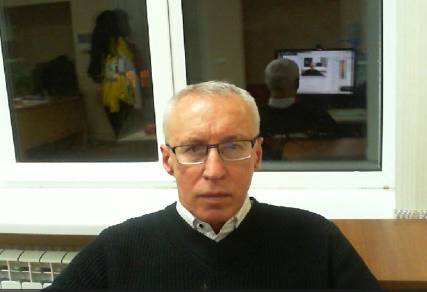

## **Резюме**  
### **Онучин Валерий Анатольевич**  
 

📞 **+7 (916) 794-74-98**  
✉ **valeriy.onuchin@yandex.ru** *(предпочитаемый способ связи)*  
📍 **Проживает:** Протвино, Московская область  
🛂 **Гражданство:** Россия  
**Возраст:** 62 года

[Индекс Хирша = 43](https://www.scopus.com/authid/detail.uri?authorId=8401982000).

**Специализация**  
- ~30 лет в профессии. Программист общего профиля
.  **Programming**: C++, C#, Kotlin, Python, bash, ++. **Building**: Make, CMake, Meson/Ninja, autotools/pkg-config, PowerShell ++ **Разработка под**: Linux, Windows, Android, Embedded 
- DevOps: кросс-платформенная сборка пакетов Linux и его ядра. Платформы: x86, Эльбрус-2000, aarch64. Автоматизация сборки, контейнеризация, CI/CD.
- Разработка проектов на **C++** и **C#** https://github.com/x2v0
- Соавтор пакета 🔗 [ROOT](https://root.cern.ch) для экспериментов Физики Высоких Энергий. http://ru.m.wikipedia.org/wiki/ROOT
- Разговорный английский. Техническая документация.
 

---

## **Опыт работы**  

### **"АО НПЦ ЭЛВИС "** *(март-декабрь 2025)* 

🔗 [elvees.ru](https://elvees.ru)

**Инженер-программист**

Разработка Альтель ОС на базе [Альт ОС](
https://www.basealt.ru)
 под отечественные платформы [Эльбрус-2000](https://ru.wikipedia.org/wiki/%D0%AD%D0%BB%D1%8C%D0%B1%D1%80%D1%83%D1%81_2000), aarch64 [Скиф процессор](https://support.elvees.com/docs/Microchips/SKIF/)

---

### **ОИЯИ, Дубна, Московская область** *(январь 2022 — декабрь 2024)*  
🔗 [jinr.ru](https://jinr.ru)  

**Программист-физик**  
Разработка ПО для эксперимента [SPD на коллайдере НИКА](https://spd.jinr.ru):  
- создание docker image для распределенных вычислений, включающий в себя
  - моделирование детектора
  - реконструкцию физических событий (Geant4, Pythia8, ROOT, Gaudi)  

**Избранные репозитории:**  
- [lfspd](https://github.com/lfspd/lfspd) — docker image для параллельных вычислений. Основан на https://linuxfromscratch.org
	Автоматическая сборка Linux дистрибутива ~200 пакетов, включающего математические, физические пакеты.
   - Технологии: chroot, python, docker, bash, cmake, системы сборки и компиляторы  
- [SpdCMake](https://git.jinr.ru/x2v0/SpdCMake) — CMake-функции для SPD эксперимента.  

---

### **АО ПРОТОМ, Протвино, Московская область** *(январь 2009 — декабрь 2021)*  
🔗 [protom.ru](https://protom.ru)  

**Инженер-программист**  
Разработка ПО для протонной терапии в медицине.  

**Избранные репозитории:**  
- [3D DICOM Viewer](https://dicom2fmm.github.io) — 3D просмотрщик, конвертер DICOM 
    - Технологии: C#, C++, DevExpress, DICOM
- [PFS/TM](https://x2v0.github.io/TM/docs) — C#-реализация протокола обмена данными  
- [EBTfilm](https://x2v0.github.io/EBTfilm) — обработка дозиметрических плёнок 
    - Технологии: C#, C++, ROOT 
- [AlignPatient](https://x2v0.github.io/AlignPatient/HTML/) — система видеоконтроля положения пациента  
    - Технологии: C#, C++, COM, DirectShow, network, real time video editting
    - Протоколы: multicast UDP, TCP/IP, RTP, SIP

---

### **ЦЕРН, Женева, Швейцария** *(сентябрь 2001 — сентябрь 2008)*  
🔗 [cern.ch](https://cern.ch)  

**Программист-физик**  
Соавтор пакета 🔗 [ROOT](https://root.cern.ch) для экспериментов Физики Высоких Энергий.  
http://ru.m.wikipedia.org/wiki/ROOT

- более 4 миллионов линий C++ кода
- сотни тысяч пользователей
- сегодня в файлах ROOT хранится более 2 эксабайт. Бозон Хиггса был открыт с помощью ROOT.

**Основной вклад:**  
- Windows-версия ROOT (Win32 API) 
- GUI-классы и GuiBuilder ([документация](https://root.cern.ch/root/htmldoc/guides/users-guide/WritingGUI.html))  
- Классы обработки изображений ([пример](https://root.cern.ch/doc/v630/group__tutorial__image.html))  
- Carrot — Apache-модуль для выполнения C++ скриптов на стороне сервера (аналог PHP)([подробнее](https://sourceforge.net/projects/carrot))  
- QtRoot (Qt, C++) ([детали](https://www.gnome-look.org/p/1131848/)) 

---

### **ИФВЭ, Протвино, Московская область** *(май 1987 — сентябрь 2001)*  
🔗 [ihep.ru](http://ihep.ru)  

**Научный сотрудник. Физик-экспериментатор** 
- Разработка и эксплуатация калориметров
- ИФВЭ: эксперимент "Комплекс Меченного Нейтрино"
- Участие в международных экспериментах (Америка: PHENIX, Minos.
   ЦЕРН: ATLAS, Alice  

---

## **Образование**  

### **Харьковский национальный университет имени В.Н. Каразина** *(1981—1987)*  
**Физико-Технический Факультет**  
📚 **Специальность:** экспериментальная ядерная физика  

